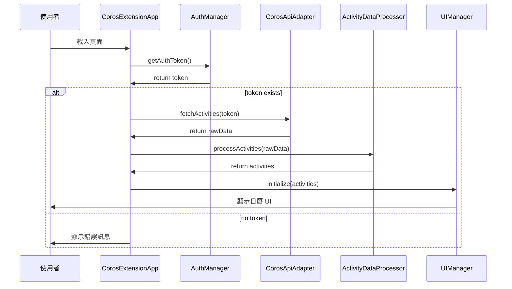
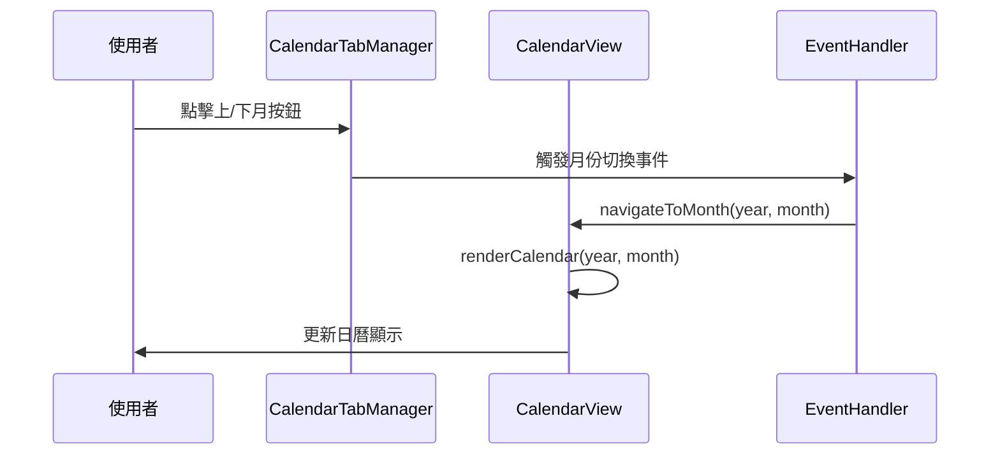
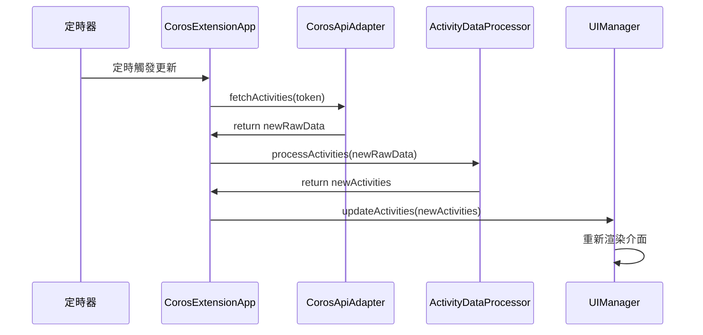
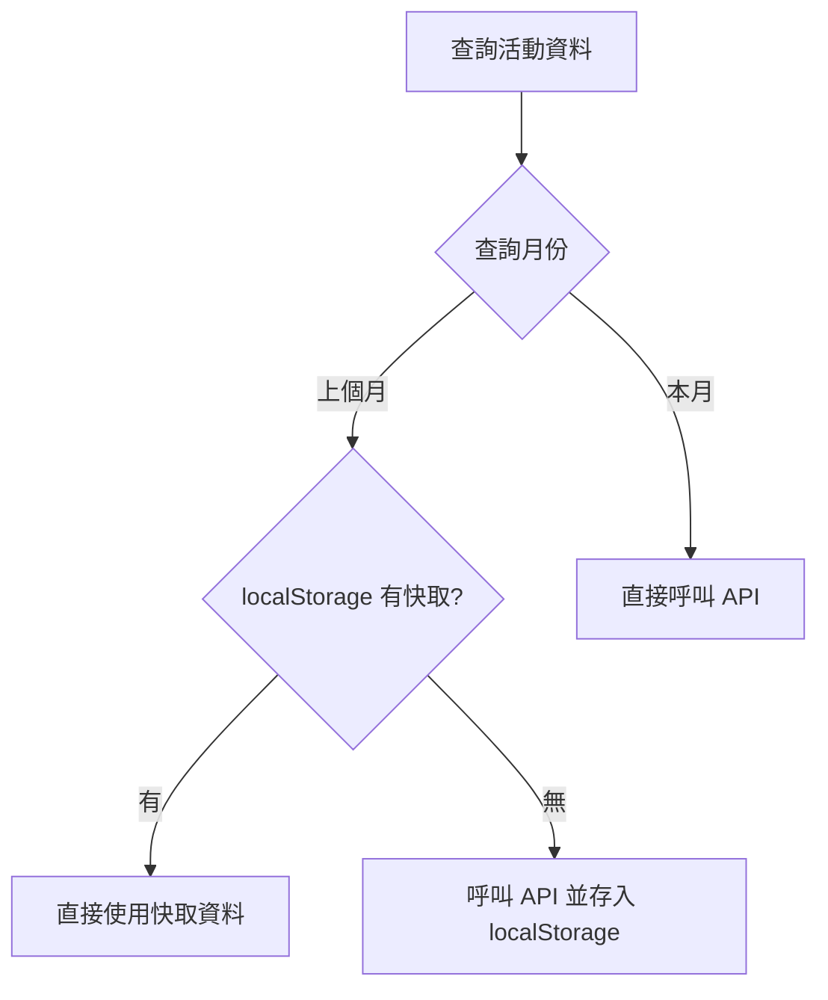

# COROS Chrome Extension - Software Design Document

## 概述

基於軟體架構設計文件的詳細軟體設計規格，包含詳細的類別設計、介面定義、資料結構與互動流程。

## 1. 系統概觀

### 1.1 系統目標
- 從 COROS API 提取使用者活動資料
- 在 COROS 官網注入日曆總覽功能
- 提供視覺化的活動統計與月曆檢視

### 1.2 主要功能
- 活動資料自動同步
- 日曆式活動檢視
- 月度統計報表
- 多運動類型支援

## 2. 詳細類別設計

### 2.1 主應用程式類別

```javascript
/**
 * 主應用程式入口點
 * 負責協調各個模組的初始化與運作
 */
class CorosExtensionApp {
  constructor() {
    this.authManager = new AuthManager();
    this.apiAdapter = new CorosApiAdapter();
    this.dataProcessor = new ActivityDataProcessor();
    this.uiManager = new UIManager();
    this.eventHandler = new EventHandler();
  }

  /**
   * 應用程式初始化
   * @returns {Promise<void>}
   */
  async initialize() {
    try {
      const token = await this.authManager.getAuthToken();
      if (!token) {
        console.warn('無法取得認證令牌');
        return;
      }

      const activities = await this.loadActivities(token);
      await this.uiManager.initialize(activities);
      this.eventHandler.bindEvents();
    } catch (error) {
      console.error('應用程式初始化失敗:', error);
    }
  }

  /**
   * 載入活動資料
   * @param {string} token - 認證令牌
   * @returns {Promise<Array>} 處理後的活動資料
   */
  async loadActivities(token) {
    const rawData = await this.apiAdapter.fetchActivities(token);
    return this.dataProcessor.processActivities(rawData);
  }
}
```

### 2.2 認證管理類別

```javascript
/**
 * 處理認證相關功能
 */
class AuthManager {
  constructor() {
    this.tokenKey = 'CPL-coros-token';
  }

  /**
   * 從 Cookie 取得認證令牌
   * @returns {Promise<string|null>} 認證令牌或 null
   */
  async getAuthToken() {
    const match = document.cookie.match(new RegExp(`${this.tokenKey}=([^;]+)`));
    const token = match ? match[1] : null;
    
    if (token) {
      console.debug('[AuthManager] 成功取得認證令牌');
    } else {
      console.warn('[AuthManager] 無法取得認證令牌');
    }
    
    return token;
  }

  /**
   * 驗證令牌有效性
   * @param {string} token - 認證令牌
   * @returns {boolean} 令牌是否有效
   */
  validateToken(token) {
    return token && token.length > 0;
  }
}
```

### 2.3 API 適配器類別

```javascript
/**
 * COROS API 介面適配器
 */
class CorosApiAdapter {
  constructor() {
    this.baseUrl = 'https://teamapi.coros.com';
    this.defaultPageSize = 100;
  }

  /**
   * 取得活動資料
   * @param {string} token - 認證令牌
   * @param {number} page - 頁碼
   * @param {number} size - 每頁筆數
   * @returns {Promise<Object>} API 回應資料
   */
  async fetchActivities(token, page = 1, size = this.defaultPageSize) {
    const url = `${this.baseUrl}/activity/query?size=${size}&pageNumber=${page}&modeList=`;
    
    try {
      const response = await fetch(url, {
        method: 'GET',
        headers: {
          'accept': 'application/json, text/plain, */*',
          'accesstoken': token,
        },
        credentials: 'include',
      });

      if (!response.ok) {
        throw new Error(`API 請求失敗: ${response.status}`);
      }

      const data = await response.json();
      console.debug('[CorosApiAdapter] API 回應:', data);
      
      return data;
    } catch (error) {
      console.error('[CorosApiAdapter] API 請求錯誤:', error);
      throw error;
    }
  }

  /**
   * 檢查 API 連線狀態
   * @param {string} token - 認證令牌
   * @returns {Promise<boolean>} 連線是否正常
   */
  async checkConnection(token) {
    try {
      await this.fetchActivities(token, 1, 1);
      return true;
    } catch {
      return false;
    }
  }
}
```

### 2.4 資料處理器類別

```javascript
/**
 * 活動資料處理器
 */
class ActivityDataProcessor {
  constructor() {
    this.sportTypeMap = this.initializeSportTypeMap();
  }

  /**
   * 處理原始活動資料
   * @param {Object} rawData - API 原始資料
   * @returns {Array} 處理後的活動陣列
   */
  processActivities(rawData) {
    const dataList = rawData?.data?.dataList || [];
    
    return dataList.map(item => ({
      id: item.id,
      date: this.formatDate(item.date),
      dateObj: new Date(this.formatDate(item.date)),
      sportType: item.sportType,
      sport: this.mapSportType(item.sportType),
      distance: Number(item.distance) / 1000, // 轉換為公里
      time: item.totalTime,
      timeFormatted: this.formatTime(item.totalTime),
      originalData: item
    }));
  }

  /**
   * 格式化日期
   * @param {number} dateNum - 數字格式日期 (YYYYMMDD)
   * @returns {string} YYYY-MM-DD 格式日期
   */
  formatDate(dateNum) {
    if (!dateNum) return '';
    const str = dateNum.toString();
    return `${str.slice(0, 4)}-${str.slice(4, 6)}-${str.slice(6, 8)}`;
  }

  /**
   * 格式化時間
   * @param {number} seconds - 秒數
   * @returns {string} HH:MM:SS 格式時間
   */
  formatTime(seconds) {
    if (typeof seconds !== 'number' || isNaN(seconds)) return '00:00:00';
    
    const h = Math.floor(seconds / 3600);
    const m = Math.floor((seconds % 3600) / 60);
    const s = seconds % 60;
    
    return [h, m, s].map(v => v.toString().padStart(2, '0')).join(':');
  }

  /**
   * 運動類型對應
   * @param {number} sportType - 運動類型代碼
   * @returns {string} 運動類型名稱
   */
  mapSportType(sportType) {
    return this.sportTypeMap[sportType] || '其他';
  }

  /**
   * 初始化運動類型對應表
   * @returns {Object} 運動類型對應表
   */
  initializeSportTypeMap() {
    return {
      100: '跑步',
      103: '田徑',
      200: '自行車',
      201: '室內自行車',
      300: '游泳',
      301: '開放水域',
      400: '有氧運動',
      402: '力量訓練',
      10000: '鐵人三項',
    };
  }

  /**
   * 按日期分組活動
   * @param {Array} activities - 活動陣列
   * @returns {Object} 以日期為鍵的活動群組
   */
  groupActivitiesByDate(activities) {
    return activities.reduce((groups, activity) => {
      const date = activity.date;
      if (!groups[date]) {
        groups[date] = [];
      }
      groups[date].push(activity);
      return groups;
    }, {});
  }

  /**
   * 計算月度統計
   * @param {Array} activities - 活動陣列
   * @param {number} year - 年份
   * @param {number} month - 月份 (0-11)
   * @returns {Object} 月度統計資料
   */
  calculateMonthlyStats(activities, year, month) {
    const monthlyActivities = activities.filter(activity => 
      activity.dateObj.getFullYear() === year && 
      activity.dateObj.getMonth() === month
    );

    const stats = {
      total: { count: 0, distance: 0, time: 0 },
      bySport: {},
      byGroup: {
        run: { count: 0, distance: 0, time: 0 },
        bike: { count: 0, distance: 0, time: 0 },
        swim: { count: 0, distance: 0, time: 0 }
      }
    };

    monthlyActivities.forEach(activity => {
      // 總計
      stats.total.count++;
      stats.total.distance += activity.distance;
      stats.total.time += this.parseTimeToSeconds(activity.time);

      // 運動類型統計
      const sportType = activity.sportType;
      if (!stats.bySport[sportType]) {
        stats.bySport[sportType] = { count: 0, distance: 0, time: 0, name: activity.sport };
      }
      stats.bySport[sportType].count++;
      stats.bySport[sportType].distance += activity.distance;
      stats.bySport[sportType].time += this.parseTimeToSeconds(activity.time);

      // 群組統計
      const code = Number(sportType);
      if (code >= 100 && code < 200) {
        stats.byGroup.run.count++;
        stats.byGroup.run.distance += activity.distance;
        stats.byGroup.run.time += this.parseTimeToSeconds(activity.time);
      } else if (code >= 200 && code < 300) {
        stats.byGroup.bike.count++;
        stats.byGroup.bike.distance += activity.distance;
        stats.byGroup.bike.time += this.parseTimeToSeconds(activity.time);
      } else if (code >= 300 && code < 400) {
        stats.byGroup.swim.count++;
        stats.byGroup.swim.distance += activity.distance;
        stats.byGroup.swim.time += this.parseTimeToSeconds(activity.time);
      }
    });

    return stats;
  }

  /**
   * 解析時間為秒數
   * @param {string|number} time - 時間
   * @returns {number} 秒數
   */
  parseTimeToSeconds(time) {
    if (typeof time === 'number') return time;
    if (typeof time === 'string' && time.includes(':')) {
      const parts = time.split(':').map(Number);
      if (parts.length === 3) {
        return parts[0] * 3600 + parts[1] * 60 + parts[2];
      } else if (parts.length === 2) {
        return parts[0] * 60 + parts[1];
      }
    }
    return 0;
  }
}
```

### 2.5 UI 管理器類別

```javascript
/**
 * 使用者介面管理器
 */
class UIManager {
  constructor() {
    this.tabManager = new CalendarTabManager();
    this.calendarView = new CalendarView();
    this.statisticsView = new StatisticsView();
    this.iconRenderer = new ActivityIconRenderer();
    this.isInitialized = false;
  }

  /**
   * 初始化 UI
   * @param {Array} activities - 活動資料
   * @returns {Promise<void>}
   */
  async initialize(activities) {
    if (this.isInitialized) return;

    try {
      await this.injectStyles();
      await this.tabManager.injectCalendarTab();
      this.calendarView.initialize(activities);
      this.statisticsView.initialize();
      
      this.isInitialized = true;
      console.debug('[UIManager] UI 初始化完成');
    } catch (error) {
      console.error('[UIManager] UI 初始化失敗:', error);
      throw error;
    }
  }

  /**
   * 注入樣式
   * @returns {Promise<void>}
   */
  async injectStyles() {
    if (document.getElementById('coros-calendar-styles')) return;

    const styleElement = document.createElement('style');
    styleElement.id = 'coros-calendar-styles';
    styleElement.textContent = this.getCalendarStyles();
    document.head.appendChild(styleElement);
  }

  /**
   * 取得日曆樣式
   * @returns {string} CSS 樣式字串
   */
  getCalendarStyles() {
    return `
      .coros-calendar-container {
        --coros-bg: #181a1b;
        --coros-fg: #f5f6fa;
        --coros-accent: #ffb300;
        --coros-cell-bg: #232527;
        --coros-cell-hover: #292b2e;
        --coros-border: #333;
      }
      .coros-calendar-grid {
        display: grid;
        grid-template-columns: repeat(7, 1fr);
        gap: 4px;
        background: var(--coros-bg);
        border-radius: 8px;
        margin-bottom: 24px;
      }
      .coros-calendar-day-header {
        text-align: center;
        font-weight: bold;
        padding: 6px 0;
        color: var(--coros-accent);
        background: transparent;
      }
      .coros-calendar-cell {
        min-height: 64px;
        background: var(--coros-cell-bg);
        border: 1px solid var(--coros-border);
        border-radius: 6px;
        padding: 4px 2px 2px 4px;
        font-size: 13px;
        position: relative;
        transition: background 0.2s;
      }
      .coros-calendar-cell.today {
        border: 2px solid var(--coros-accent);
      }
      .coros-calendar-cell .coros-activity {
        display: flex;
        align-items: center;
        font-size: 12px;
        margin-top: 2px;
        gap: 2px;
      }
      .coros-calendar-report {
        background: var(--coros-cell-bg);
        border-radius: 8px;
        padding: 16px;
        margin-top: 8px;
        border: 1px solid var(--coros-border);
      }
      .coros-calendar-report-title {
        font-size: 16px;
        font-weight: bold;
        margin-bottom: 8px;
        color: var(--coros-accent);
      }
      .coros-calendar-report-table {
        width: 100%;
        border-collapse: collapse;
      }
      .coros-calendar-report-table th, 
      .coros-calendar-report-table td {
        padding: 4px 8px;
        text-align: left;
      }
      .coros-calendar-report-table th {
        color: var(--coros-accent);
      }
    `;
  }

  /**
   * 更新活動資料
   * @param {Array} activities - 新的活動資料
   */
  updateActivities(activities) {
    this.calendarView.updateActivities(activities);
    this.statisticsView.updateActivities(activities);
  }

  /**
   * 顯示錯誤訊息
   * @param {string} message - 錯誤訊息
   */
  showError(message) {
    console.error('[UIManager]', message);
    // 可以在此處添加視覺化錯誤提示
  }
}
```

### 2.6 日曆檢視類別

```javascript
/**
 * 日曆檢視元件
 */
class CalendarView {
  constructor() {
    this.activities = [];
    this.currentYear = new Date().getFullYear();
    this.currentMonth = new Date().getMonth();
    this.dataProcessor = new ActivityDataProcessor();
    this.iconRenderer = new ActivityIconRenderer();
  }

  /**
   * 初始化日曆檢視
   * @param {Array} activities - 活動資料
   */
  initialize(activities) {
    this.activities = activities;
    this.setupInitialMonth();
  }

  /**
   * 設定初始月份
   */
  setupInitialMonth() {
    const today = new Date();
    if (today.getDate() < 3) {
      // 月初前三天顯示上個月
      this.currentMonth = today.getMonth() - 1;
      this.currentYear = today.getFullYear();
      if (this.currentMonth < 0) {
        this.currentMonth = 11;
        this.currentYear--;
      }
    } else {
      this.currentMonth = today.getMonth();
      this.currentYear = today.getFullYear();
    }
  }

  /**
   * 渲染日曆
   * @param {number} year - 年份
   * @param {number} month - 月份 (0-11)
   * @returns {string} 日曆 HTML
   */
  renderCalendar(year = this.currentYear, month = this.currentMonth) {
    this.currentYear = year;
    this.currentMonth = month;

    const activityMap = this.dataProcessor.groupActivitiesByDate(this.activities);
    const monthStats = this.dataProcessor.calculateMonthlyStats(this.activities, year, month);
    
    const navigationHtml = this.renderNavigation(year, month);
    const statsHtml = this.renderGroupStats(monthStats.byGroup);
    const gridHtml = this.renderCalendarGrid(year, month, activityMap);
    const reportHtml = this.renderMonthlyReport(monthStats.bySport);

    return `
      ${navigationHtml}
      ${statsHtml}
      ${gridHtml}
      ${reportHtml}
    `;
  }

  /**
   * 渲染月份導航
   * @param {number} year - 年份
   * @param {number} month - 月份
   * @returns {string} 導航 HTML
   */
  renderNavigation(year, month) {
    const monthNames = [
      '一月', '二月', '三月', '四月', '五月', '六月',
      '七月', '八月', '九月', '十月', '十一月', '十二月'
    ];

    return `
      <div class="arco-btn-group mx-16">
        <button id="monthPrevBtn" class="arco-btn arco-btn-secondary arco-btn-shape-square arco-btn-size-medium arco-btn-status-normal" type="button">
          <span class="iconfont iconxiangzuo text-14"></span>
        </button>
        <h2 id="currentMonth" class="text-2xl font-semibold mx-4">
          ${monthNames[month]} ${year}
        </h2>
        <button id="monthNextBtn" class="arco-btn arco-btn-secondary arco-btn-shape-square arco-btn-size-medium arco-btn-status-normal" type="button">
          <span class="iconfont iconxiangyou text-14"></span>
        </button>
      </div>
    `;
  }

  /**
   * 渲染群組統計
   * @param {Object} groupStats - 群組統計資料
   * @returns {string} 群組統計 HTML
   */
  renderGroupStats(groupStats) {
    return `
      <table class="coros-calendar-report-table" style="margin-bottom:12px;">
        <tr>
          <td>${this.iconRenderer.getSportIcon(100)}</td>
          <td>跑步 ${groupStats.run.distance.toFixed(2)} km ${this.dataProcessor.formatTime(groupStats.run.time)}</td>
          <td>${this.iconRenderer.getSportIcon(200)}</td>
          <td>自行車 ${groupStats.bike.distance.toFixed(2)} km ${this.dataProcessor.formatTime(groupStats.bike.time)}</td>
          <td>${this.iconRenderer.getSportIcon(300)}</td>
          <td>游泳 ${groupStats.swim.distance.toFixed(2)} km ${this.dataProcessor.formatTime(groupStats.swim.time)}</td>
        </tr>
      </table>
    `;
  }

  /**
   * 渲染日曆格線
   * @param {number} year - 年份
   * @param {number} month - 月份
   * @param {Object} activityMap - 活動對應表
   * @returns {string} 日曆格線 HTML
   */
  renderCalendarGrid(year, month, activityMap) {
    const weekDays = ['日', '一', '二', '三', '四', '五', '六'];
    const daysInMonth = new Date(year, month + 1, 0).getDate();
    const firstDay = new Date(year, month, 1).getDay();
    const today = new Date();

    let gridHtml = '<div class="coros-calendar-grid">';
    
    // 星期標題
    weekDays.forEach(day => {
      gridHtml += `<div class="coros-calendar-day-header">${day}</div>`;
    });

    // 空白格子
    for (let i = 0; i < firstDay; i++) {
      gridHtml += '<div class="coros-calendar-cell"></div>';
    }

    // 日期格子
    for (let day = 1; day <= daysInMonth; day++) {
      const dateStr = `${year}-${String(month + 1).padStart(2, '0')}-${String(day).padStart(2, '0')}`;
      const isToday = (today.getDate() === day && today.getMonth() === month && today.getFullYear() === year);
      
      gridHtml += `<div class="coros-calendar-cell${isToday ? ' today' : ''}">`;
      gridHtml += `<div style="font-weight:bold">${day}</div>`;
      
      if (activityMap[dateStr]) {
        gridHtml += this.renderDayActivities(activityMap[dateStr]);
      }
      
      gridHtml += '</div>';
    }

    gridHtml += '</div>';
    return gridHtml;
  }

  /**
   * 渲染單日活動
   * @param {Array} dayActivities - 單日活動陣列
   * @returns {string} 單日活動 HTML
   */
  renderDayActivities(dayActivities) {
    const activityGroups = this.groupActivitiesByType(dayActivities);
    let activitiesHtml = '';

    Object.keys(activityGroups).forEach(sportType => {
      const activities = activityGroups[sportType];
      const totalDistance = activities.reduce((sum, activity) => sum + activity.distance, 0);
      const sportName = activities[0].sport;
      
      activitiesHtml += `
        <div class="coros-activity">
          <span class="coros-activity-icon">${this.iconRenderer.getSportIcon(sportType)}</span>
          ${sportName}
          <span style="margin-left:4px;color:#aaa;">${totalDistance.toFixed(2)}km</span>
        </div>
      `;
    });

    return activitiesHtml;
  }

  /**
   * 按運動類型分組活動
   * @param {Array} activities - 活動陣列
   * @returns {Object} 按運動類型分組的活動
   */
  groupActivitiesByType(activities) {
    return activities.reduce((groups, activity) => {
      const sportType = activity.sportType;
      if (!groups[sportType]) {
        groups[sportType] = [];
      }
      groups[sportType].push(activity);
      return groups;
    }, {});
  }

  /**
   * 渲染月度報表
   * @param {Object} sportStats - 運動統計資料
   * @returns {string} 月度報表 HTML
   */
  renderMonthlyReport(sportStats) {
    let reportHtml = `
      <div class="coros-calendar-report">
        <div class="coros-calendar-report-title">本月活動總結</div>
        <table class="coros-calendar-report-table">
          <thead>
            <tr>
              <th></th>
              <th>運動類型</th>
              <th>次數</th>
              <th>總距離 (km)</th>
              <th>總時間</th>
            </tr>
          </thead>
          <tbody>
    `;

    Object.keys(sportStats).forEach(sportType => {
      const stats = sportStats[sportType];
      reportHtml += `
        <tr>
          <td class="arco-table-td arco-table-col-fixed-left td-Sport_Image">
            ${this.iconRenderer.getSportIcon(sportType)}
          </td>
          <td>${stats.name} - ${sportType}</td>
          <td>${stats.count}</td>
          <td>${stats.distance.toFixed(2)}</td>
          <td>${this.dataProcessor.formatTime(stats.time)}</td>
        </tr>
      `;
    });

    reportHtml += `
          </tbody>
        </table>
      </div>
    `;

    return reportHtml;
  }

  /**
   * 更新活動資料
   * @param {Array} activities - 新的活動資料
   */
  updateActivities(activities) {
    this.activities = activities;
  }

  /**
   * 切換到指定月份
   * @param {number} year - 年份
   * @param {number} month - 月份
   */
  navigateToMonth(year, month) {
    this.currentYear = year;
    this.currentMonth = month;
  }
}
```

### 2.7 運動圖示渲染器

```javascript
/**
 * 運動類型圖示渲染器
 */
class ActivityIconRenderer {
  constructor() {
    this.sportIconMap = this.initializeSportIconMap();
  }

  /**
   * 取得運動圖示
   * @param {number} sportType - 運動類型代碼
   * @returns {string} 圖示 HTML
   */
  getSportIcon(sportType) {
    const iconConfig = this.sportIconMap[sportType] || this.sportIconMap.other;
    
    return `
      <span class="arco-table-cell arco-table-cell-align-left">
        <span class="arco-table-td-content">
          <div data-v-16496a7c="" class="flex-1 flex">
            <span data-v-16496a7c="" 
                  class="iconfont-sport iconfont-sport ${iconConfig.icon} text-20" 
                  data-sport="${iconConfig.dataSport}" 
                  style="color: ${iconConfig.color};">
            </span>
          </div>
        </span>
      </span>
    `;
  }

  /**
   * 初始化運動圖示對應表
   * @returns {Object} 運動圖示對應表
   */
  initializeSportIconMap() {
    return {
      100: { 
        icon: 'icon-outrun', 
        dataSport: 100, 
        color: 'rgb(248, 192, 50)' 
      },
      103: { 
        icon: 'icon-groundrun', 
        dataSport: 103, 
        color: 'rgb(255, 99, 132)' 
      },
      200: { 
        icon: 'icon-cycle', 
        dataSport: 200, 
        color: 'rgb(75, 192, 192)' 
      },
      201: { 
        icon: 'icon-indoor_bike', 
        dataSport: 201, 
        color: 'rgb(75, 192, 192)' 
      },
      300: { 
        icon: 'icon-poolswim', 
        dataSport: 300, 
        color: 'rgb(54, 162, 235)' 
      },
      301: { 
        icon: 'icon-openwater', 
        dataSport: 301, 
        color: 'rgb(0, 204, 204)' 
      },
      400: { 
        icon: 'icon-Indoor_erobics', 
        dataSport: 400, 
        color: 'rgb(217, 46, 218)' 
      },
      402: { 
        icon: 'icon-strength', 
        dataSport: 402, 
        color: 'rgb(153, 102, 255)' 
      },
      10000: { 
        icon: 'icon-triathlon', 
        dataSport: 10000, 
        color: 'rgb(255, 159, 64)' 
      },
      other: { 
        icon: 'icon-other', 
        dataSport: '', 
        color: 'rgb(200, 200, 200)' 
      }
    };
  }
}
```

## 3. 互動流程設計

### 3.1 應用程式啟動流程



### 3.2 月份切換流程



### 3.3 資料更新流程



## 4. 資料結構定義

### 4.1 活動資料結構

```typescript
interface Activity {
  id: string;
  date: string;           // YYYY-MM-DD 格式
  dateObj: Date;         // Date 物件
  sportType: number;     // 運動類型代碼
  sport: string;         // 運動類型名稱
  distance: number;      // 距離 (公里)
  time: number;          // 時間 (秒)
  timeFormatted: string; // 格式化時間 HH:MM:SS
  originalData: any;     // 原始 API 資料
}
```

### 4.2 統計資料結構

```typescript
interface MonthlyStats {
  total: {
    count: number;
    distance: number;
    time: number;
  };
  bySport: {
    [sportType: string]: {
      count: number;
      distance: number;
      time: number;
      name: string;
    };
  };
  byGroup: {
    run: { count: number; distance: number; time: number; };
    bike: { count: number; distance: number; time: number; };
    swim: { count: number; distance: number; time: number; };
  };
}
```

### 4.3 運動圖示配置結構

```typescript
interface SportIconConfig {
  icon: string;      // CSS 類別名稱
  dataSport: number; // data-sport 屬性值
  color: string;     // 圖示顏色
}
```

## 5. 錯誤處理策略

### 5.1 API 錯誤處理
- 網路連線錯誤: 顯示重試按鈕
- 認證失敗: 提示使用者重新登入
- 資料格式錯誤: 記錄錯誤並使用預設值

### 5.2 UI 錯誤處理
- DOM 操作失敗: 嘗試重新初始化
- 樣式載入失敗: 使用內建樣式
- 事件綁定失敗: 重新綁定事件

### 5.3 資料處理錯誤
- 日期格式錯誤: 使用當前日期
- 數值轉換錯誤: 使用預設值 0
- 資料缺失: 跳過該筆資料

## 6. 效能優化策略

### 6.1 資料快取與 API 呼叫優化
- 活動資料本地快取：
  - 查詢「上個月」的資料時，先檢查 localStorage 是否已有快取。
    - 若有快取，直接使用快取資料，避免重複 API 呼叫。
    - 若無快取，呼叫 API 並將結果存入 localStorage。
  - 查詢「本月」資料時，直接呼叫 API，不做快取。
- 圖示渲染結果快取
- DOM 元素快取

#### 6.1.1 快取流程說明



#### 6.1.2 快取邏輯範例（JavaScript）

```javascript
function getLastMonthKey() {
  const now = new Date();
  const year = now.getMonth() === 0 ? now.getFullYear() - 1 : now.getFullYear();
  const month = now.getMonth() === 0 ? 12 : now.getMonth();
  return `data-${year}-${month}`;
}

function isLastMonth(year, month) {
  const now = new Date();
  const lastMonth = now.getMonth() === 0 ? 12 : now.getMonth();
  const lastYear = now.getMonth() === 0 ? now.getFullYear() - 1 : now.getFullYear();
  return year === lastYear && month === lastMonth;
}

async function queryData(year, month) {
  if (isLastMonth(year, month)) {
    const cacheKey = getLastMonthKey();
    const cached = localStorage.getItem(cacheKey);
    if (cached) {
      return JSON.parse(cached);
    }
    const data = await fetchDataFromApi(year, month);
    localStorage.setItem(cacheKey, JSON.stringify(data));
    return data;
  } else {
    // 本月或其他月份，直接查詢
    return await fetchDataFromApi(year, month);
  }
}
// 假設這是你的 API 呼叫函式
async function fetchDataFromApi(year, month) {
  // ...API 呼叫邏輯...
}
```

### 6.2 渲染優化
- 虛擬滾動 (如需要)
- 延遲載入
- 批次 DOM 更新

### 6.3 記憶體管理
- 事件監聽器清理
- 定時器清理
- 不必要的參考清除

---

**文件版本**: 1.0  
**建立日期**: 2025-06-06  
**最後更新**: 2025-06-06
